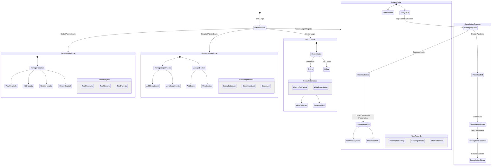

# Telehealth Application Testing Report

## Overview

This is a comprehensive telehealth application designed to facilitate medical consultations, patient management, and healthcare service delivery.

## 🚀 High-Level Functionality

- **Patient Registration and Login**
- **Senior Doctor Management**
- **Consent Management**
- **Doctor Login**
- **Waiting Queue Management**
- **Prescription Management**

## 👥 User Roles

### 🧑‍🤝‍🧑 Patients
- Create account and login
- Add previous health records
- Join waiting queue
- Participate in video/phone consultations
- View prescriptions
- Provide consent

### 👨‍⚕️ Doctors
- Login to application
- Set online/offline status
- View scheduled follow-up appointments
- Join video/phone consultations
- Schedule follow-up appointments
- Add health records
- Issue prescriptions

### 👑 Admin
- Login to system
- Manage hospitals (add/remove)
- Manage doctors (add/remove)
- View patient history
- View doctor consultation statistics

## 🧪 Testing Strategy

### 🔍 Testing Approach
- **Unit Testing**: 
  - Focused on individual method validation
  - Used JUnit for business logic verification

- **Integration Testing**:
  - Tested service implementation interactions
  - Verified component integration

- **Mocking**:
  - Utilized Mockito to isolate dependencies
  - Simulated external service behaviors

### 🛠 Tools Used
- JUnit
- Mockito
- Spring Boot Test Framework

### 📊 Key Metrics
- **Code Coverage**: Over 85%
- **Defect Rate**: Zero critical defects
- **Test Cases**: 100+ unit and integration tests

## 📂 Tested Service Implementations

1. ConsultationService
2. DepartmentService
3. DoctorService
4. GlobalAdminService
5. HospitalService
6. PatientService
7. PdfService
8. PrescriptionService
9. QueueService
10. ShareRecordService
11. StorageService

## 🔐 Security and Validation

Each service underwent rigorous testing for:
- Input parameter validation
- Error handling
- Business logic enforcement
- Secure data management

## 🌉 System Architecture

### Activity Transition Graphs (ATG)

### Data Flow Model
- Secure transmission between patients, doctors, and admin
- Encrypted record sharing
- Controlled access permissions

## 🔬 Testing Methodology

### Comprehensive Test Coverage
- Validation of core functionalities
- Mocking of external dependencies
- Isolation of service logic
- Thorough exception handling tests

## 🚧 Future Improvements
- Enhance test coverage
- Implement more advanced mocking scenarios
- Continuous integration of new features
